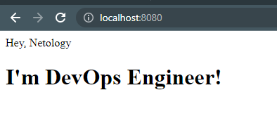

# Домашнее задание к занятию "5.3. Введение. Экосистема. Архитектура. Жизненный цикл Docker контейнера"

## Как сдавать задания

Обязательными к выполнению являются задачи без указания звездочки. Их выполнение необходимо для получения зачета и диплома о профессиональной переподготовке.

Задачи со звездочкой (*) являются дополнительными задачами и/или задачами повышенной сложности. Они не являются обязательными к выполнению, но помогут вам глубже понять тему.

Домашнее задание выполните в файле readme.md в github репозитории. В личном кабинете отправьте на проверку ссылку на .md-файл в вашем репозитории.

Любые вопросы по решению задач задавайте в чате Slack.

---

## Задача 1

Сценарий выполения задачи:

- создайте свой репозиторий на https://hub.docker.com;
- выберете любой образ, который содержит веб-сервер Nginx;
- создайте свой fork образа;
- реализуйте функциональность:
запуск веб-сервера в фоне с индекс-страницей, содержащей HTML-код ниже:
```
<html>
<head>
Hey, Netology
</head>
<body>
<h1>I’m DevOps Engineer!</h1>
</body>
</html>
```
Опубликуйте созданный форк в своем репозитории и предоставьте ответ в виде ссылки на https://hub.docker.com/username_repo.


## Ответ

- https://hub.docker.com/r/filipp0vap/netology




---

## Задача 2

Посмотрите на сценарий ниже и ответьте на вопрос:
"Подходит ли в этом сценарии использование Docker контейнеров или лучше подойдет виртуальная машина, физическая машина? Может быть возможны разные варианты?"

Детально опишите и обоснуйте свой выбор.

--

Сценарий:

- Высоконагруженное монолитное java веб-приложение;
- Nodejs веб-приложение;
- Мобильное приложение c версиями для Android и iOS;
- Шина данных на базе Apache Kafka;
- Elasticsearch кластер для реализации логирования продуктивного веб-приложения - три ноды elasticsearch, два logstash и две ноды kibana;
- Мониторинг-стек на базе Prometheus и Grafana;
- MongoDB, как основное хранилище данных для java-приложения;
- Gitlab сервер для реализации CI/CD процессов и приватный (закрытый) Docker Registry.


## Ответ

- На опыте встречал такое монолитное java приложение, вариант развертывания был без контейнеров на виртуальной машине. Возможно такой выбор целесообразнее так как контейнеры удобнее при микросервисной архитектуре, а при монолитной преимущества не так очевидны. Приложение в вопросе "высоконагруженное", и думаю на физической машине без контейнера и гипервизора можно достичь большей производительности.  Так что я бы склонялся к физической машине.

- Nodejs приложение развернул бы в докере. Скорее всего оно будет микросервисным и контейнеры будут удобнее. 

- Шину бы развернул на вм при критичности данных. Но если не страшно грохнуть контейнер вместе с данными то можно и в докер.

- ELK стек делал бы в одном докер компоузе. Но использовал бы 3 разных вм, так как в тз 3 ноды. В контейнерах удобно масштабировать, обновлять и обеспечивать идемпотентность (ведь нам же хочется что бы все 3 ноды были идентичны иначе какой смысл в нодах) + я такое на практике встречал, работало нормально.

- К сожалению с Prometheus не работал, думаю развернул бы в контейнерах как и elk стэк

- Для MongoDB выбрал бы вм. в контейнерах держать бд не очень хорошо (+ об этом и спикер говорил)

- Гитлаб и докер реестр реализовал бы на отдельных вм. Но если производительность машин и пропускная способность сети позволяет можно и на одной вм. В контейнерах как мне кажется это не очень удобно хранить, только если гитлаб.


---

## Задача 3

- Запустите первый контейнер из образа ***centos*** c любым тэгом в фоновом режиме, подключив папку ```/data``` из текущей рабочей директории на хостовой машине в ```/data``` контейнера;
- Запустите второй контейнер из образа ***debian*** в фоновом режиме, подключив папку ```/data``` из текущей рабочей директории на хостовой машине в ```/data``` контейнера;
- Подключитесь к первому контейнеру с помощью ```docker exec``` и создайте текстовый файл любого содержания в ```/data```;
- Добавьте еще один файл в папку ```/data``` на хостовой машине;
- Подключитесь во второй контейнер и отобразите листинг и содержание файлов в ```/data``` контейнера.

## Ответ


```
PS D:\DevOps\virt-homeworks\05-virt-03-docker> docker run -it -d --name centos -v D:\DevOps\virt-homeworks\05-virt-03-docker\data:/data centos
1cdd7d395f9214e480335dc2a4f53dd83519b4ad21b208c4a8181d621410ef05
PS D:\DevOps\virt-homeworks\05-virt-03-docker> docker run -it -d --name debian -v D:\DevOps\virt-homeworks\05-virt-03-docker\data:/data debian
00a87f039768529fe45e1d299fa81f90d3ac961987b633466f61a7460f0ed695
PS D:\DevOps\virt-homeworks\05-virt-03-docker> docker ps
CONTAINER ID   IMAGE                           COMMAND                  CREATED          STATUS          PORTS                  NAMES
00a87f039768   debian                          "bash"                   20 seconds ago   Up 18 seconds                          debian
1cdd7d395f92   centos                          "/bin/bash"              2 minutes ago    Up 2 minutes                           centos
PS D:\DevOps\virt-homeworks\05-virt-03-docker> docker exec -it centos bash
[root@1cdd7d395f92 /]# cd data
[root@1cdd7d395f92 data]# echo "test1" > file1
[root@1cdd7d395f92 data]# exit
exit
PS D:\DevOps\virt-homeworks\05-virt-03-docker> echo "test" > data\file2
PS D:\DevOps\virt-homeworks\05-virt-03-docker> docker exec -it debian bash
root@00a87f039768:/# cd data
root@00a87f039768:/data# ls -la
total 4
drwxrwxrwx 1 root root  512 May 29 17:36 .
drwxr-xr-x 1 root root 4096 May 29 17:38 ..
-rw-r--r-- 1 root root    6 May 29 17:36 file1
-rwxrwxrwx 1 root root    6 May 29 17:35 file2
root@00a87f039768:/data# cat file1
test1
root@00a87f039768:/data# cat file2
test
root@00a87f039768:/data#
```

---

## Задача 4 (*)

Воспроизвести практическую часть лекции самостоятельно.

Соберите Docker образ с Ansible, загрузите на Docker Hub и пришлите ссылку вместе с остальными ответами к задачам.


---

### Как cдавать задание

Выполненное домашнее задание пришлите ссылкой на .md-файл в вашем репозитории.

---
