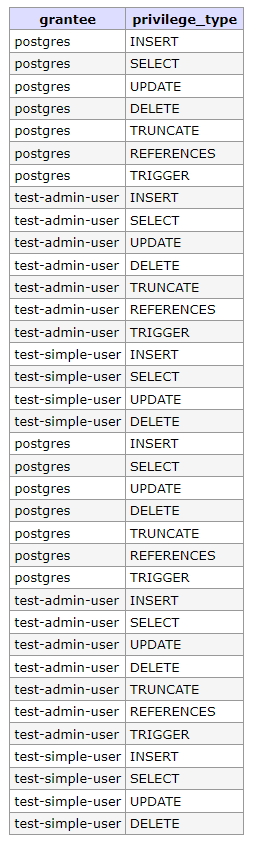

# Домашнее задание к занятию "6.2. SQL"

## Введение

Перед выполнением задания вы можете ознакомиться с 
[дополнительными материалами](https://github.com/netology-code/virt-homeworks/tree/master/additional/README.md).

## Задача 1

Используя docker поднимите инстанс PostgreSQL (версию 12) c 2 volume, 
в который будут складываться данные БД и бэкапы.

Приведите получившуюся команду или docker-compose манифест.


## Ответ
```docker-compose
version: '3.1'

services:

  db:
    image: postgres:12.11-alpine
    restart: always
    volumes:
      - ./data:/var/lib/postgresql/data 
      - ./backups:/var/lib/postgresql/backups
    environment:
      POSTGRES_PASSWORD: example

  adminer:
    image: adminer
    restart: always
    ports:
      - 8082:8080

```

---
## Задача 2

В БД из задачи 1: 
- создайте пользователя test-admin-user и БД test_db
- в БД test_db создайте таблицу orders и clients (спeцификация таблиц ниже)
- предоставьте привилегии на все операции пользователю test-admin-user на таблицы БД test_db
- создайте пользователя test-simple-user
- предоставьте пользователю test-simple-user права на SELECT/INSERT/UPDATE/DELETE данных таблиц БД test_db

Таблица orders:
- id (serial primary key)
- наименование (string)
- цена (integer)

Таблица clients:
- id (serial primary key)
- ФИО (string)
- страна проживания (string, index)
- заказ (foreign key orders)

Приведите:
- итоговый список БД после выполнения пунктов выше,
- описание таблиц (describe)
- SQL-запрос для выдачи списка пользователей с правами над таблицами test_db
- список пользователей с правами над таблицами test_db

## Ответ
SQL запросы по пунктам выше:
```sql
CREATE DATABASE test_db;
CREATE USER "test-admin-user";


CREATE TABLE orders  (id SERIAL PRIMARY KEY,  наименование CHAR(50),  цена INTEGER);
CREATE TABLE clients  (id SERIAL PRIMARY KEY,  ФИО CHAR(50),  страна проживания CHAR(50), заказ INTEGER REFERENCES orders (id));

CREATE INDEX country_idx ON clients("страна проживания");

GRANT ALL ON orders, clients TO "test-admin-user";

CREATE USER "test-simple-user";

GRANT SELECT, INSERT, UPDATE, DELETE ON orders, clients TO "test-simple-user";
```

- итоговый список БД после выполнения пунктов выше:
```bash
test_db=# \l
                                 List of databases
   Name    |  Owner   | Encoding |  Collate   |   Ctype    |   Access privileges
-----------+----------+----------+------------+------------+-----------------------
 postgres  | postgres | UTF8     | en_US.utf8 | en_US.utf8 |
 template0 | postgres | UTF8     | en_US.utf8 | en_US.utf8 | =c/postgres          +
           |          |          |            |            | postgres=CTc/postgres
 template1 | postgres | UTF8     | en_US.utf8 | en_US.utf8 | =c/postgres          +
           |          |          |            |            | postgres=CTc/postgres
 test_db   | postgres | UTF8     | en_US.utf8 | en_US.utf8 |
(4 rows)

```

- описание таблиц (describe):
```bash
test_db=# \d orders
                                  Table "public.orders"
    Column    |     Type      | Collation | Nullable |              Default
--------------+---------------+-----------+----------+------------------------------------
 id           | integer       |           | not null | nextval('orders_id_seq'::regclass)
 наименование | character(50) |           |          |
 цена         | integer       |           |          |
Indexes:
    "orders_pkey" PRIMARY KEY, btree (id)
Referenced by:
    TABLE "clients" CONSTRAINT "clients_заказ_fkey" FOREIGN KEY ("заказ") REFERENCES orders(id)

test_db=# \d clients
                                     Table "public.clients"
      Column       |     Type      | Collation | Nullable |               Default
-------------------+---------------+-----------+----------+-------------------------------------
 id                | integer       |           | not null | nextval('clients_id_seq'::regclass)
 ФИО               | character(50) |           |          |
 страна проживания | character(50) |           |          |
 заказ             | integer       |           |          |
Indexes:
    "clients_pkey" PRIMARY KEY, btree (id)
    "country_idx" btree ("страна проживания")
Foreign-key constraints:
    "clients_заказ_fkey" FOREIGN KEY ("заказ") REFERENCES orders(id)

```

- SQL-запрос для выдачи списка пользователей с правами над таблицами test_db:
```sql
SELECT grantee, privilege_type 
FROM information_schema.role_table_grants 
WHERE table_name='orders' OR table_name='clients';
```

- список пользователей с правами над таблицами test_db:



---
## Задача 3

Используя SQL синтаксис - наполните таблицы следующими тестовыми данными:

Таблица orders

|Наименование|цена|
|------------|----|
|Шоколад| 10 |
|Принтер| 3000 |
|Книга| 500 |
|Монитор| 7000|
|Гитара| 4000|

Таблица clients

|ФИО|Страна проживания|
|------------|----|
|Иванов Иван Иванович| USA |
|Петров Петр Петрович| Canada |
|Иоганн Себастьян Бах| Japan |
|Ронни Джеймс Дио| Russia|
|Ritchie Blackmore| Russia|

Используя SQL синтаксис:
- вычислите количество записей для каждой таблицы 
- приведите в ответе:
    - запросы 
    - результаты их выполнения.


## Ответ

Наполнение:
```sql
INSERT INTO orders ("наименование", "цена") VALUES ('Шоколад', 10), ('Принтер', 3000), ('Книга', 500), ('Монитор', 7000), ('Гитара', 4000);
INSERT INTO clients ("ФИО", "страна проживания") VALUES ('Иванов Иван Иванович', 'USA'), ('Петров Петр Петрович', 'Canada'), ('Иоганн Себастьян Бах', 'Japan'), ('Ронни Джеймс Дио', 'Russia'), ('Ritchie Blackmore', 'Russia');
```
- вычислите количество записей для каждой таблицы:
```sql
test_db=# SELECT COUNT(*) FROM clients;
 count
-------
     5
(1 row)

test_db=# SELECT COUNT(*) FROM orders;
 count
-------
     5
(1 row)

```

---
## Задача 4

Часть пользователей из таблицы clients решили оформить заказы из таблицы orders.

Используя foreign keys свяжите записи из таблиц, согласно таблице:

|ФИО|Заказ|
|------------|----|
|Иванов Иван Иванович| Книга |
|Петров Петр Петрович| Монитор |
|Иоганн Себастьян Бах| Гитара |

Приведите SQL-запросы для выполнения данных операций.

Приведите SQL-запрос для выдачи всех пользователей, которые совершили заказ, а также вывод данного запроса.
 
Подсказк - используйте директиву `UPDATE`.

## Ответ

```sql
UPDATE clients SET "заказ" = 3 WHERE "ФИО" = 'Иванов Иван Иванович';
UPDATE clients SET "заказ" = 4 WHERE "ФИО" = 'Петров Петр Петрович';
UPDATE clients SET "заказ" = 5 WHERE "ФИО" = 'Иоганн Себастьян Бах';
```
```SQL
test_db=# SELECT * FROM clients WHERE "заказ" IS NOT NULL;
 id |                        ФИО                         |                 страна проживания                  | заказ
----+----------------------------------------------------+----------------------------------------------------+-------
  1 | Иванов Иван Иванович                               | USA                                                |     3
  2 | Петров Петр Петрович                               | Canada                                             |     4
  3 | Иоганн Себастьян Бах                               | Japan                                              |     5

```

---

## Задача 5

Получите полную информацию по выполнению запроса выдачи всех пользователей из задачи 4 
(используя директиву EXPLAIN).

Приведите получившийся результат и объясните что значат полученные значения.

## Ответ

```sql
test_db=# EXPLAIN SELECT * FROM clients WHERE "заказ" IS NOT NULL;
                       QUERY PLAN
---------------------------------------------------------
 Seq Scan on clients  (cost=0.00..1.05 rows=5 width=416)
   Filter: ("заказ" IS NOT NULL)
(2 rows)
```

Scan on clients: приблизительное время через сколько начнется сканирование, приблизительное время завершения запроса, оценочное количество выводимых строк, ширина строк в байтах.

Во второй строке применяемый фильтр.

---

## Задача 6

Создайте бэкап БД test_db и поместите его в volume, предназначенный для бэкапов (см. Задачу 1).

Остановите контейнер с PostgreSQL (но не удаляйте volumes).

Поднимите новый пустой контейнер с PostgreSQL.

Восстановите БД test_db в новом контейнере.

Приведите список операций, который вы применяли для бэкапа данных и восстановления. 

## Ответ

1. Создаем бекап командой:
```bash
~/backups $  pg_dump -d test_db > test_db.sql
```
2. Останавливаем контейнер:
```bash
docker-compose down
```
3. Поднимаем новый контейнер:
```bash
docker run -d \
	--name some-postgres \
	-e POSTGRES_PASSWORD=example \
	-e PGDATA=/var/lib/postgresql/data/pgdata \
	-v /host/psql/newdata:/var/lib/postgresql/data \
	-v /host/psql/backups:/var/lib/postgresql/backups \
	postgres:12.11-alpine
```
4. Восстановите БД test_db в новом контейнере:
```bash
docker exec -it some-postgres bash
su postgres
psql -c "CREATE DATABASE test_db;"
psql -d test_db -f /var/lib/postgresql/backups/test_db.sql

```

---

### Как cдавать задание

Выполненное домашнее задание пришлите ссылкой на .md-файл в вашем репозитории.

---
