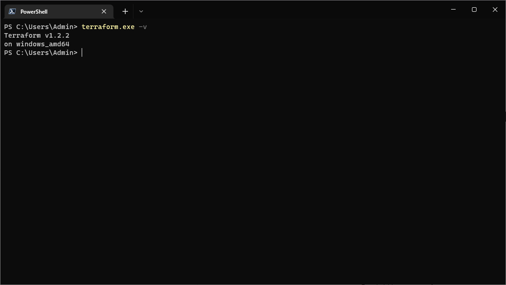
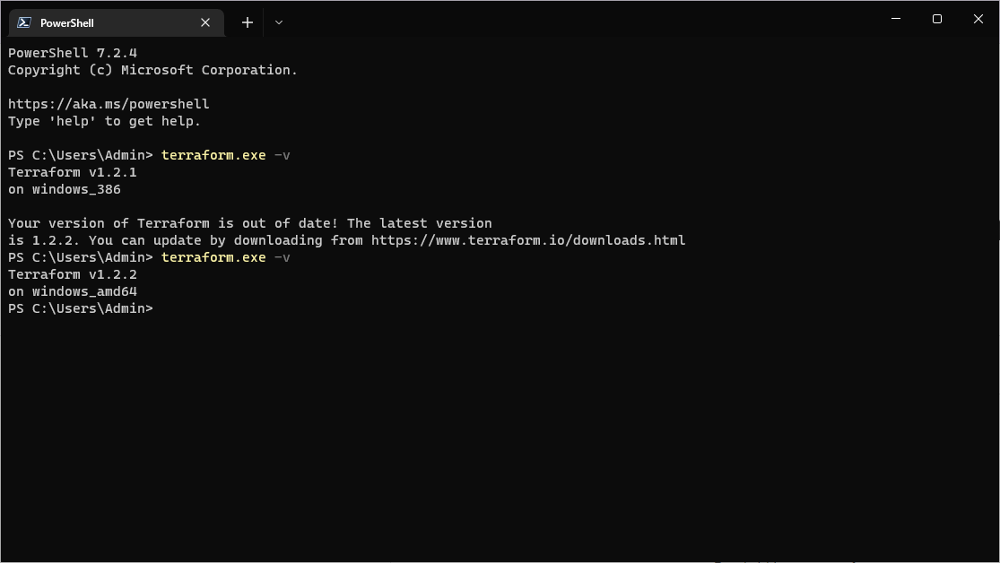

# Домашнее задание к занятию "7.1. Инфраструктура как код"

## Задача 1. Выбор инструментов. 
 
### Легенда
 
Через час совещание на котором менеджер расскажет о новом проекте. Начать работу над которым надо 
будет уже сегодня. 
На данный момент известно, что это будет сервис, который ваша компания будет предоставлять внешним заказчикам.
Первое время, скорее всего, будет один внешний клиент, со временем внешних клиентов станет больше.

Так же по разговорам в компании есть вероятность, что техническое задание еще не четкое, что приведет к большому
количеству небольших релизов, тестирований интеграций, откатов, доработок, то есть скучно не будет.  
   
Вам, как девопс инженеру, будет необходимо принять решение об инструментах для организации инфраструктуры.
На данный момент в вашей компании уже используются следующие инструменты: 
- остатки Сloud Formation, 
- некоторые образы сделаны при помощи Packer,
- год назад начали активно использовать Terraform, 
- разработчики привыкли использовать Docker, 
- уже есть большая база Kubernetes конфигураций, 
- для автоматизации процессов используется Teamcity, 
- также есть совсем немного Ansible скриптов, 
- и ряд bash скриптов для упрощения рутинных задач.  

Для этого в рамках совещания надо будет выяснить подробности о проекте, что бы в итоге определиться с инструментами:

1. Какой тип инфраструктуры будем использовать для этого проекта: изменяемый или не изменяемый?
1. Будет ли центральный сервер для управления инфраструктурой?
1. Будут ли агенты на серверах?
1. Будут ли использованы средства для управления конфигурацией или инициализации ресурсов? 
 
В связи с тем, что проект стартует уже сегодня, в рамках совещания надо будет определиться со всеми этими вопросами.

### В результате задачи необходимо

1. Ответить на четыре вопроса представленных в разделе "Легенда". 
1. Какие инструменты из уже используемых вы хотели бы использовать для нового проекта? 
1. Хотите ли рассмотреть возможность внедрения новых инструментов для этого проекта? 

Если для ответа на эти вопросы недостаточно информации, то напишите какие моменты уточните на совещании.

## Ответ

Сразу оговорюсь что у меня мало опыта и из всех инструментов в задании я работал только с Docker и bash. Но постараюсь написать как я представляю решение этой задачи.

Для начала стоит уточнить какая инфраструктура вообще планируется и планируется ли вообще. Это будут физические машины или виртуальные? Если виртуальные то как будут разворачиваться. У нас уже есть какой то развернутый гипервизор типа VMWare vSphere или мы будем использовать IaaS решения. Или у нас есть свое IaaS облако и можно развернуть инфраструктуру в нем?

Судя по тому что используется СloudFormation и Terraform я предполагаю что у нас либо гипервизор либо IaaS.

Представим что выбрали свое IaaS решение. - ОК

Нужно уточнить есть ли какие то требования у заказчика, возможно это будет какая то инфраструктура для критичных к изменениям среды сервисам - как в примере спикера с банками. Тогда стоит сделать выбор к не изменяемой инфраструктуре.

Если у заказчика нет каких то требований в этой части, то так будет активная разработка, то я бы рекомендовал использовать изменяемую инфраструктуру.

Так как мы уже сделали выбор в сторону IaaS облака, вопрос с центральным сервером отпадает.

Так же так как почти все инструменты уже работают без агентов на машинах это тоже можно не брать в расчет.

Видя что уже есть опыт использования Terraform и Packer я бы вернулся к ним и использовал для развертывания инфраструктуры.
Особенно это полезно если будем использовать K8s, так как сможем обеспечивать идемпотентность при развертывании нод. А K8s я бы тоже рекомендовал так как разработчики привыкли работать с Docker и уже есть база с конфигурациями

Через Ansible можно будет расскатывать докеры на ноды автоматически.

А еще стоит уточнить что это будет за приложение. Если это микросервисы то с k8s в самый раз. А если монолит то наверно k8s стоит отбросить, и Docker думаю тоже.
Но представим что все ок и это микросервисы.

Teamcity так же хороший инструмент от него не стал бы отказываться. Плюс от может работать с k8s и билдить в него.

Единственное от чего я бы отказался это от баш скриптов. Так как у нас будет все и так автоматизированно - IaC, Ci\Cd, K8s. В идеале инженерам вообще не надо ходить на прод и что то там делать руками. Всю рутину можно будет описать в TeamCity

Еще не оч понятно есть ли какая то гит система, и если есть то какая.
Если это GitLab, то можно в нем настроить Ci\Cd и от Teamcity постепенно отказаться.

Еще я бы уточнил какие БД предполагается использовать, тут у меня так же не очень много опыта. Единственное что рекомендовал бы это не запихивать их в докер.

По итогу предложил бы развернуть инфраструктуру в облаке, настроить Ci\Cd в TeamCity или GitLab, развернуть k8s  и в нем уже крутить докеры с сервисами.

p.s.

Очень интересно узнать мнение проверяющего\преподавателя так как ситуация выглядит как вполне реальная задача и все что я нафантазировал возможно не правильно или очень не правильно и лучше узнать это на обучении чем на практике 😄

---

## Задача 2. Установка терраформ. 

Официальный сайт: https://www.terraform.io/

Установите терраформ при помощи менеджера пакетов используемого в вашей операционной системе.
В виде результата этой задачи приложите вывод команды `terraform --version`.

## Ответ

---

## Задача 3. Поддержка легаси кода. 

В какой-то момент вы обновили терраформ до новой версии, например с 0.12 до 0.13. 
А код одного из проектов настолько устарел, что не может работать с версией 0.13. 
В связи с этим необходимо сделать так, чтобы вы могли одновременно использовать последнюю версию терраформа установленную при помощи
штатного менеджера пакетов и устаревшую версию 0.12. 

В виде результата этой задачи приложите вывод `--version` двух версий терраформа доступных на вашем компьютере 
или виртуальной машине.

## Ответ

---

### Как cдавать задание

Выполненное домашнее задание пришлите ссылкой на .md-файл в вашем репозитории.

---
